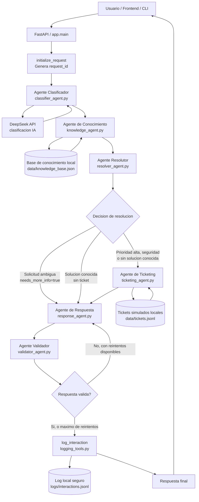
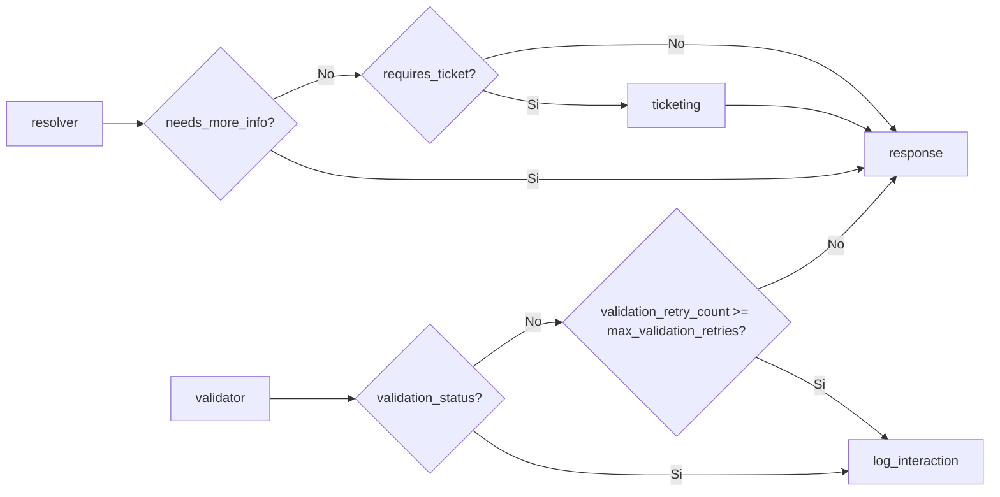

# Diagrama de Orquestacion de Agentes

Este diagrama representa el flujo implementado en `graph/support_graph.py` para procesar solicitudes de soporte TI.

## Responsabilidades por Nodo

| Nodo | Responsabilidad | Archivo |
| --- | --- | --- |
| `initialize_request` | Crea un `request_id` unico si la solicitud no lo trae. | `graph/support_graph.py` |
| `classifier` | Clasifica la solicitud y asigna categoria/prioridad usando DeepSeek o fallback local. | `agents/classifier_agent.py` |
| `knowledge` | Busca articulos y una posible solucion en la base de conocimiento local. | `agents/knowledge_agent.py` |
| `resolver` | Decide si responder, pedir mas informacion o crear un ticket. | `agents/resolver_agent.py` |
| `ticketing` | Crea un ticket simulado en almacenamiento local. | `agents/ticketing_agent.py` |
| `response` | Construye la respuesta que recibira el usuario. | `agents/response_agent.py` |
| `validator` | Valida que la respuesta no este vacia, no pida datos sensibles y contenga ticket cuando corresponde. | `agents/validator_agent.py` |
| `log_interaction` | Registra la interaccion sin guardar el mensaje crudo del usuario. | `tools/logging_tools.py` |

## Reglas de Enrutamiento

