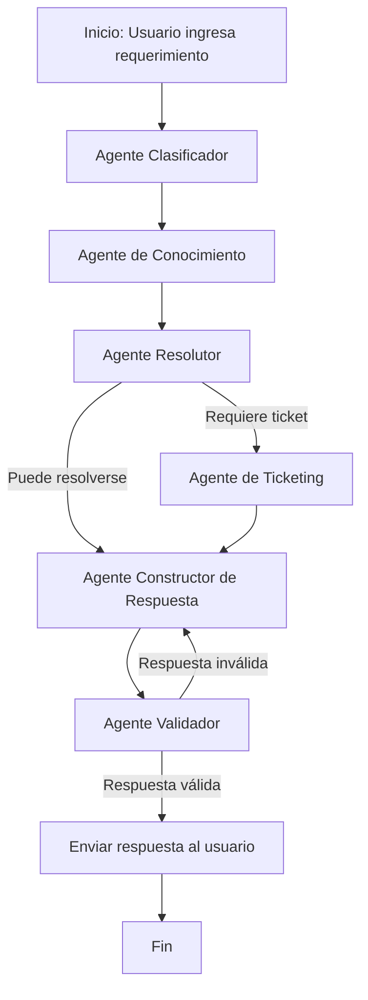

# Requerimiento Funcional  
## Solución: Agentic Support Orchestrator con LangChain, LangGraph y DeepSeek

**Versión:** 1.0  
**Fecha:** 2026-07-05  
**Tipo de solución:** Prototipo local / Docker  
**Modelo razonador:** DeepSeek Reasoner  
**Frameworks:** LangChain + LangGraph  

---

## 1. Nombre del requerimiento

**RF-001: Implementar una solución de orquestación de agentes para atención de requerimientos TI**

---

## 2. Objetivo funcional

Implementar una solución simple de inteligencia artificial basada en **orquestación de agentes**, capaz de recibir una solicitud de soporte TI en lenguaje natural, clasificarla, consultar una base de conocimiento local, decidir si puede responder automáticamente o si debe generar un ticket simulado, validar la respuesta final y entregar una salida clara al usuario.

La solución usará:

- **LangGraph** para orquestar el flujo entre agentes mediante un grafo de estados, nodos y transiciones.
- **LangChain** para integrar el modelo razonador DeepSeek y estructurar la interacción con prompts.
- **DeepSeek Reasoner** como modelo principal de razonamiento.
- **Tools locales en Python** para ejecutar acciones como búsqueda en base de conocimiento y creación simulada de tickets.

La solución deberá correr en ambiente **local** o mediante **Docker**. No se requiere Azure, AWS, GCP ni otro servicio cloud para alojar la aplicación.

Se aclara que el **modelo de IA será consumido mediante la API de DeepSeek**. El resto de componentes de la solución deberá ejecutarse localmente por ahora: código Python, orquestación LangGraph, base de conocimiento, tools, ticketing simulado, logs, pruebas, consola y API local opcional.

---

## 3. Descripción general de la solución

La solución será un asistente inteligente de soporte TI que recibe mensajes como:

> “No puedo acceder a mi cuenta corporativa. Me sale error de contraseña inválida, pero estoy seguro de que la contraseña es correcta.”

A partir de ese mensaje, la solución deberá ejecutar un flujo de agentes:

1. Clasificar el requerimiento.
2. Consultar una base de conocimiento local.
3. Evaluar si existe solución conocida.
4. Decidir si se responde automáticamente o se genera un ticket.
5. Construir una respuesta clara.
6. Validar la respuesta final.
7. Entregar la respuesta al usuario.

---

## 4. Alcance funcional

La solución deberá permitir:

1. Recibir un requerimiento textual del usuario.
2. Identificar la categoría funcional del requerimiento.
3. Consultar una base de conocimiento local.
4. Determinar si el caso puede resolverse automáticamente.
5. Crear un ticket simulado cuando el caso requiera atención humana.
6. Generar una respuesta clara para el usuario.
7. Validar la respuesta antes de entregarla.
8. Registrar el resultado de la interacción.
9. Ejecutarse por consola local.
10. Ejecutarse opcionalmente mediante una API local.
11. Ejecutarse en Docker.

---

## 5. Fuera de alcance funcional

Para la primera versión no se considera:

- Integración real con ServiceNow.
- Integración real con Jira.
- Integración real con Azure DevOps.
- Integración con Active Directory.
- Autenticación corporativa.
- Gestión real de usuarios y roles.
- Envío de correos.
- Persistencia empresarial.
- Despliegue cloud.
- Integración con Teams, Slack o WhatsApp.
- Manejo de archivos adjuntos.
- Monitoreo empresarial avanzado.
- Interfaz web productiva.
- Fine-tuning de modelos.

---

## 6. Actores funcionales

| Actor | Descripción |
|---|---|
| Usuario final | Persona que ingresa un requerimiento de soporte TI. |
| Agente Clasificador | Identifica la categoría y prioridad inicial del requerimiento. |
| Agente de Conocimiento | Consulta información relevante en una base de conocimiento local. |
| Agente Resolutor | Decide si el caso puede resolverse automáticamente o si debe escalarse. |
| Agente de Ticketing | Genera un ticket simulado cuando se requiere intervención humana. |
| Agente Constructor de Respuesta | Redacta la respuesta que será entregada al usuario. |
| Agente Validador | Verifica claridad, coherencia y completitud de la respuesta final. |
| Administrador técnico | Configura el modelo, la base de conocimiento y parámetros de ejecución. |

---

## 7. Caso de uso principal

### CU-001: Atender requerimiento de soporte TI

**Actor principal:** Usuario final  

**Descripción:**  
El usuario ingresa una solicitud de soporte TI y el sistema ejecuta un flujo de agentes para entregar una respuesta o generar un ticket simulado.

### Flujo principal

1. El usuario ingresa su requerimiento.
2. El sistema recibe el mensaje.
3. El Agente Clasificador analiza el mensaje.
4. El sistema asigna una categoría y prioridad inicial.
5. El Agente de Conocimiento busca información relacionada en la base local.
6. El Agente Resolutor evalúa si existe una solución aplicable.
7. Si existe solución suficiente, el sistema genera una respuesta automática.
8. Si no existe solución suficiente, el sistema genera un ticket simulado.
9. El Agente Constructor de Respuesta prepara la respuesta final.
10. El Agente Validador revisa la respuesta.
11. Si la respuesta es válida, se entrega al usuario.
12. Si la respuesta no es válida, se reformula.
13. El flujo finaliza.

### Flujo alternativo A: solicitud ambigua

1. El usuario ingresa una solicitud poco clara.
2. El sistema no puede determinar con confianza la categoría o acción.
3. El Agente Resolutor indica que se requiere más información.
4. El sistema responde solicitando datos adicionales al usuario.

### Flujo alternativo B: error en base de conocimiento

1. El Agente de Conocimiento intenta leer la base local.
2. La base no está disponible o tiene error de formato.
3. El sistema registra el error.
4. El Agente Resolutor decide si genera una respuesta genérica o un ticket simulado.
5. El usuario recibe una respuesta controlada.

---

## 8. Categorías funcionales iniciales

| Categoría | Ejemplos |
|---|---|
| Acceso / autenticación | Problemas de login, contraseña, MFA, cuenta bloqueada. |
| Red / conectividad | VPN, Wi-Fi, internet, conexión corporativa. |
| Hardware | Laptop, teclado, mouse, monitor, periféricos. |
| Software | Aplicaciones, instalación, errores de programas. |
| Solicitud administrativa | Permisos, accesos, aprobaciones, solicitudes internas. |
| Otro | Casos que no encajan claramente en las categorías anteriores. |

---

## 9. Agentes funcionales

## 9.1 Agente Clasificador

### Objetivo

Clasificar el mensaje del usuario en una categoría funcional y asignar una prioridad inicial.

### Entrada

```json
{
  "user_message": "No puedo acceder a mi cuenta corporativa"
}
```

### Salida esperada

```json
{
  "category": "Acceso / autenticación",
  "priority": "Media",
  "requires_ticket": false
}
```

### Reglas funcionales

| Condición | Resultado esperado |
|---|---|
| El mensaje menciona login, contraseña, MFA o cuenta bloqueada | Categoría: Acceso / autenticación |
| El mensaje menciona VPN, Wi-Fi o conexión | Categoría: Red / conectividad |
| El mensaje menciona laptop, monitor, teclado o mouse | Categoría: Hardware |
| El mensaje menciona aplicación, instalación o error de software | Categoría: Software |
| El mensaje solicita permisos o aprobaciones | Categoría: Solicitud administrativa |
| No se identifica una categoría clara | Categoría: Otro |

---

## 9.2 Agente de Conocimiento

### Objetivo

Consultar una base de conocimiento local para recuperar artículos o soluciones relacionadas con la categoría detectada.

### Entrada

```json
{
  "category": "Acceso / autenticación",
  "user_message": "No puedo acceder a mi cuenta corporativa"
}
```

### Salida esperada

```json
{
  "knowledge_results": [
    "KB-001: Problemas comunes de autenticación",
    "KB-004: Validación de MFA"
  ],
  "possible_solution": "Verificar bloqueo de cuenta, expiración de contraseña y estado de MFA."
}
```

### Reglas funcionales

| Condición | Resultado esperado |
|---|---|
| Existe artículo para la categoría | Recuperar artículo relevante |
| Existen varios artículos | Priorizar los más relacionados |
| No existe artículo | Devolver lista vacía |
| Error en la base local | Informar error controlado al estado del flujo |

---

## 9.3 Agente Resolutor

### Objetivo

Determinar si el caso puede ser resuelto automáticamente o si requiere creación de ticket simulado.

### Entrada

```json
{
  "category": "Acceso / autenticación",
  "priority": "Media",
  "knowledge_results": [
    "KB-001: Problemas comunes de autenticación"
  ],
  "possible_solution": "Verificar bloqueo de cuenta y MFA."
}
```

### Salida esperada

```json
{
  "requires_ticket": true,
  "resolution_decision": "Crear ticket por posible bloqueo de cuenta o validación de credenciales."
}
```

### Reglas funcionales

| Condición | Acción |
|---|---|
| Existe solución conocida y el caso es de baja complejidad | Responder automáticamente |
| No existe solución conocida | Crear ticket simulado |
| El caso es crítico o de alto impacto | Crear ticket simulado con prioridad alta |
| El usuario reporta impacto masivo | Crear ticket simulado con prioridad alta |
| La solicitud es ambigua | Solicitar más información |
| El caso involucra credenciales, bloqueo recurrente o seguridad | Crear ticket o recomendar canal oficial |

---

## 9.4 Agente de Ticketing

### Objetivo

Crear un ticket simulado para registrar el caso cuando se requiere atención humana.

### Entrada

```json
{
  "category": "Acceso / autenticación",
  "description": "Usuario no puede acceder a su cuenta corporativa",
  "priority": "Media"
}
```

### Salida esperada

```json
{
  "ticket_id": "INC-20260705120000",
  "status": "Created"
}
```

### Reglas funcionales

| Condición | Resultado esperado |
|---|---|
| El resolver indica `requires_ticket = true` | Crear ticket simulado |
| El ticket se crea correctamente | Guardar `ticket_id` en el estado |
| El ticket no se puede crear | Responder con mensaje controlado |
| El ticket se crea | Incluir identificador en la respuesta final |

---

## 9.5 Agente Constructor de Respuesta

### Objetivo

Construir una respuesta entendible, ordenada y accionable para el usuario.

### Entrada

```json
{
  "category": "Acceso / autenticación",
  "possible_solution": "Verificar bloqueo de cuenta y MFA.",
  "requires_ticket": true,
  "ticket_id": "INC-20260705120000"
}
```

### Salida esperada

```json
{
  "draft_response": "Hemos identificado que tu solicitud está relacionada con acceso/autenticación..."
}
```

### Reglas funcionales

La respuesta deberá:

1. Indicar la categoría detectada.
2. Explicar brevemente la situación.
3. Mostrar pasos sugeridos, si existen.
4. Indicar si se generó un ticket.
5. Mostrar el número de ticket cuando aplique.
6. No prometer acciones que no se hayan ejecutado.
7. Mantener tono profesional y claro.

---

## 9.6 Agente Validador

### Objetivo

Validar que la respuesta final sea clara, coherente y segura antes de entregarse al usuario.

### Validaciones mínimas

| Validación | Criterio |
|---|---|
| Claridad | La respuesta debe entenderse sin conocimiento técnico avanzado. |
| Acción | Debe incluir pasos o decisión tomada. |
| Coherencia | La respuesta debe coincidir con el estado del flujo. |
| Ticket | Si se creó ticket, debe incluir su identificador. |
| No alucinación | No debe inventar herramientas, canales o acciones no ejecutadas. |
| Seguridad | No debe solicitar contraseñas ni datos sensibles. |

### Salida esperada

```json
{
  "validation_status": true,
  "final_response": "Hemos identificado que tu solicitud está relacionada con acceso/autenticación..."
}
```

---

## 10. Flujo funcional de orquestación



---

## 11. Estado funcional compartido

```json
{
  "request_id": "REQ-20260705-0001",
  "user_message": "No puedo acceder a mi cuenta corporativa",
  "category": "Acceso / autenticación",
  "priority": "Media",
  "requires_ticket": true,
  "knowledge_results": [
    "KB-001: Problemas comunes de autenticación"
  ],
  "possible_solution": "Verificar bloqueo de cuenta y MFA.",
  "ticket_id": "INC-20260705120000",
  "draft_response": "Texto preliminar de respuesta",
  "final_response": "Texto final validado",
  "validation_status": true
}
```

---

## 12. Ejemplo de interacción esperada

### Entrada del usuario

```text
No puedo acceder a mi cuenta corporativa. Me sale error de contraseña inválida.
```

### Resultado esperado del sistema

```text
Hemos identificado que tu solicitud está relacionada con acceso/autenticación.

Te recomendamos validar lo siguiente:

1. Verifica si tu cuenta está bloqueada.
2. Confirma si tu contraseña ha expirado.
3. Revisa que el MFA esté activo y funcionando correctamente.
4. Si el problema continúa, deberá revisarlo el equipo de soporte.

Se ha generado el ticket simulado INC-20260705120000 para seguimiento.
```

---

## 13. Requerimientos funcionales detallados

| ID | Requerimiento | Prioridad |
|---|---|---|
| RF-001 | El sistema deberá recibir solicitudes en lenguaje natural. | Alta |
| RF-002 | El sistema deberá clasificar automáticamente la solicitud. | Alta |
| RF-003 | El sistema deberá consultar una base de conocimiento local. | Alta |
| RF-004 | El sistema deberá determinar si responde o genera ticket. | Alta |
| RF-005 | El sistema deberá generar tickets simulados localmente. | Alta |
| RF-006 | El sistema deberá construir una respuesta clara para el usuario. | Alta |
| RF-007 | El sistema deberá validar la respuesta final antes de mostrarla. | Alta |
| RF-008 | El sistema deberá manejar solicitudes ambiguas. | Media |
| RF-009 | El sistema deberá registrar el resultado del flujo. | Media |
| RF-010 | El sistema deberá permitir ejecución local. | Alta |
| RF-011 | El sistema deberá permitir ejecución mediante Docker. | Alta |
| RF-012 | El sistema deberá permitir extender nuevas categorías y agentes. | Media |

---

## 14. Criterios de aceptación funcional

La solución será aceptada cuando:

1. El usuario pueda ingresar un requerimiento por consola o API local.
2. El sistema clasifique el requerimiento en una categoría definida.
3. El sistema consulte una base de conocimiento local.
4. El sistema determine si debe responder o generar ticket simulado.
5. El sistema genere un ticket simulado cuando corresponda.
6. El sistema construya una respuesta clara y accionable.
7. El sistema valide la respuesta final antes de entregarla.
8. El sistema no solicite contraseñas ni datos sensibles.
9. El sistema maneje solicitudes ambiguas solicitando más información.
10. El sistema pueda ejecutarse localmente.
11. El sistema pueda ejecutarse en Docker.
12. El sistema no dependa de Azure ni de servicios cloud para alojarse.

---

## 15. Historias de usuario

| ID | Historia de usuario | Criterio de aceptación |
|---|---|---|
| HU-001 | Como usuario, quiero ingresar un problema en lenguaje natural para recibir ayuda. | El sistema recibe y procesa el mensaje. |
| HU-002 | Como usuario, quiero que mi problema sea clasificado automáticamente. | El sistema devuelve una categoría. |
| HU-003 | Como usuario, quiero recibir pasos de solución cuando existan. | El sistema consulta la KB y genera recomendaciones. |
| HU-004 | Como usuario, quiero que se genere un ticket si el problema no puede resolverse. | El sistema devuelve un identificador de ticket simulado. |
| HU-005 | Como usuario, quiero recibir una respuesta clara y profesional. | El validador aprueba la respuesta final. |
| HU-006 | Como administrador, quiero poder modificar la base de conocimiento local. | El sistema lee artículos desde un archivo local editable. |
| HU-007 | Como administrador, quiero poder agregar nuevas categorías. | El clasificador puede ampliarse sin rediseñar todo el flujo. |

---

## 16. Reglas de negocio

| ID | Regla |
|---|---|
| RN-001 | Todo requerimiento debe tener una categoría asignada. |
| RN-002 | Si no existe solución en la base de conocimiento, se debe crear ticket simulado o solicitar más información. |
| RN-003 | Los casos de seguridad, credenciales o bloqueo recurrente deben ser tratados con mayor cautela. |
| RN-004 | El sistema no debe solicitar contraseñas al usuario. |
| RN-005 | El sistema no debe indicar que creó un ticket si el ticket no fue generado en el estado. |
| RN-006 | Toda respuesta final debe pasar por validación. |
| RN-007 | La solución debe poder ejecutarse sin infraestructura cloud. |

---

## 17. Supuestos

1. El usuario ingresará mensajes de texto en español.
2. La primera versión usará una base de conocimiento local.
3. El ticketing será simulado.
4. DeepSeek Reasoner será usado como modelo razonador.
5. La aplicación correrá localmente o en Docker.
6. El modelo de IA se consumirá mediante la API de DeepSeek usando una API Key configurada en variables de entorno.
7. Salvo la invocación al modelo DeepSeek, todos los componentes del prototipo correrán localmente por ahora.
8. No se requiere autenticación para el prototipo inicial.
9. El objetivo es demostrar orquestación de agentes, no construir una mesa de ayuda productiva.

---

## 18. Riesgos funcionales

| Riesgo | Impacto | Mitigación |
|---|---|---|
| Clasificación incorrecta | Medio | Agregar reglas de fallback y ejemplos. |
| Respuesta poco clara | Medio | Usar Agente Validador. |
| Usuario entrega información sensible | Alto | Incluir reglas para no solicitar ni almacenar contraseñas. |
| Base de conocimiento incompleta | Medio | Crear ticket cuando no exista solución confiable. |
| Exceso de dependencia del LLM | Medio | Ejecutar decisiones críticas mediante reglas del flujo. |

---

## 19. Métricas funcionales sugeridas

| Métrica | Descripción |
|---|---|
| Tasa de clasificación correcta | Porcentaje de solicitudes clasificadas correctamente. |
| Tasa de resolución automática | Porcentaje de casos respondidos sin ticket. |
| Tasa de tickets generados | Porcentaje de casos derivados a ticket simulado. |
| Tasa de respuestas validadas | Porcentaje de respuestas aprobadas por el validador. |
| Tiempo promedio de respuesta | Tiempo desde entrada hasta salida final. |
| Casos ambiguos | Número de solicitudes que requieren más información. |

---

## 20. Resultado funcional esperado

Al finalizar la implementación, se tendrá un prototipo funcional llamado:

**Agentic Support Orchestrator**

El prototipo demostrará:

- Recepción de requerimientos en lenguaje natural.
- Clasificación automática.
- Consulta de conocimiento local.
- Decisión entre respuesta automática y ticket simulado.
- Orquestación de agentes.
- Validación de respuesta final.
- Ejecución local.
- Ejecución en Docker.
- Uso de DeepSeek como modelo razonador.
- Uso de LangChain y LangGraph como base de la solución.

---

## 21. Referencias técnicas de apoyo

- LangGraph permite modelar flujos usando estado compartido, nodos y edges, incluyendo transiciones condicionales.
- LangGraph está orientado a la orquestación de agentes y workflows stateful.
- La integración de DeepSeek con LangChain se realiza mediante el paquete `langchain-deepseek`.
- `deepseek-reasoner` no debe ser tratado como modelo con tool calling nativo; las tools deberán ejecutarse desde nodos Python del flujo.
