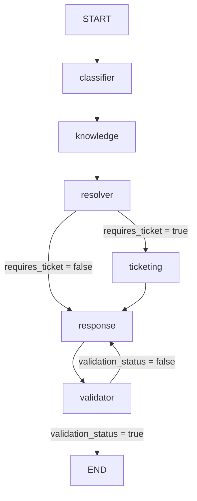

# Requerimiento Técnico  
## Solución: Agentic Support Orchestrator con LangChain, LangGraph y DeepSeek

**Versión:** 1.0  
**Fecha:** 2026-07-05  
**Tipo de solución:** Prototipo local / Docker  
**Modelo razonador:** DeepSeek Reasoner  
**Frameworks:** LangChain + LangGraph  
**Lenguaje:** Python 3.11+  

---

## 1. Nombre del requerimiento técnico

**RT-001: Implementación técnica local de una solución de orquestación de agentes usando LangChain, LangGraph y DeepSeek**

---

## 2. Objetivo técnico

Implementar un prototipo funcional en Python que permita orquestar múltiples agentes especializados para atender requerimientos de soporte TI en lenguaje natural.

La solución deberá ejecutarse en:

- Ambiente local.
- Contenedor Docker.

La solución deberá utilizar:

- **LangGraph** para definir la orquestación de agentes mediante nodos, estado compartido y transiciones condicionales.
- **LangChain** para integrar el modelo LLM y estructurar la interacción con prompts.
- **DeepSeek Reasoner** como modelo principal de razonamiento.
- **Tools locales en Python** para búsqueda en base de conocimiento, creación simulada de tickets y reglas de soporte.

---

## 3. Aclaración técnica sobre ejecución local

La aplicación deberá correr localmente o dentro de Docker.

Esto significa que los siguientes componentes serán locales:

- Código Python.
- API local opcional.
- Base de conocimiento.
- Lógica de orquestación.
- Tools.
- Ticketing simulado.
- Logs.
- Tests.

El modelo razonador será DeepSeek. Para consumirlo, se utilizará la **API de DeepSeek** mediante una API Key configurada en variables de entorno.

Por ahora, solo la invocación al modelo de IA dependerá de un servicio externo. El resto de componentes deberá correr localmente o dentro de Docker: aplicación Python, API local, orquestación LangGraph, tools, base de conocimiento, ticketing simulado, logs y tests.

---

## 4. Aclaración técnica sobre DeepSeek Reasoner

El modelo principal será:

```text
deepseek-reasoner
```

Consideraciones:

1. `deepseek-reasoner` será usado para razonamiento, clasificación, decisión y validación.
2. Las tools no serán invocadas directamente por el modelo.
3. Las tools serán ejecutadas por nodos Python dentro de LangGraph.
4. La salida del modelo deberá ser interpretada por cada nodo.
5. Las decisiones críticas deberán tener reglas de fallback para evitar dependencia total del LLM.
6. Si en una versión futura se requiere tool calling nativo, se podrá evaluar un modelo compatible.

---

## 5. Alcance técnico actualizado

La solución técnica deberá incluir:

1. Proyecto Python estructurado por capas.
2. Ejecución por consola local.
3. API local opcional con FastAPI.
4. Dockerfile para ejecución en contenedor.
5. Docker Compose para levantar la solución.
6. Configuración por archivo `.env`.
7. Integración con DeepSeek mediante LangChain.
8. Orquestación con LangGraph.
9. Estado compartido entre agentes.
10. Agentes implementados como nodos Python.
11. Tools locales implementadas como funciones Python.
12. Base de conocimiento local en JSON.
13. Ticketing simulado local.
14. Logs locales.
15. Pruebas unitarias básicas.
16. README de ejecución.

---

## 6. Fuera de alcance técnico

No se implementará en esta primera versión:

- Azure.
- AWS.
- GCP.
- Kubernetes.
- Azure OpenAI.
- Azure Functions.
- Azure App Service.
- Azure Container Apps.
- Azure SQL.
- ServiceNow real.
- Jira real.
- Azure DevOps real.
- Active Directory.
- Autenticación corporativa.
- Base de datos productiva.
- Frontend productivo.
- Persistencia avanzada de conversaciones.
- Monitoreo empresarial avanzado.
- LangSmith obligatorio.
- RAG vectorial productivo.
- Manejo de adjuntos.

---

## 7. Arquitectura técnica propuesta

```text
Usuario
  |
  v
CLI local / API local FastAPI
  |
  v
Application Layer
  |
  v
LangGraph Orchestrator
  |
  |-- Classifier Node
  |-- Knowledge Node
  |-- Resolver Node
  |-- Ticketing Node
  |-- Response Builder Node
  |-- Validator Node
  |
  v
Respuesta final
```

---

## 8. Componentes técnicos

| Componente | Descripción | Tecnología |
|---|---|---|
| Orquestador | Coordina el flujo entre agentes | LangGraph |
| Modelo razonador | Analiza, clasifica, decide y valida | DeepSeek Reasoner |
| Integración LLM | Cliente para consumir DeepSeek | LangChain / langchain-deepseek |
| Agentes | Nodos especializados del flujo | Python |
| Tools locales | Funciones llamadas desde nodos | Python |
| Base de conocimiento | Fuente local de soluciones | JSON |
| Ticketing mock | Simulación de creación de tickets | Python |
| API local | Endpoint REST para pruebas | FastAPI |
| Servidor API | Ejecución local de API | Uvicorn |
| Logs | Registro local del flujo | logging |
| Contenedor | Empaquetado y ejecución | Docker |
| Testing | Pruebas unitarias | pytest |

---

## 9. Stack técnico

| Capa | Tecnología |
|---|---|
| Lenguaje | Python 3.11+ |
| Orquestación | LangGraph |
| LLM Framework | LangChain |
| Modelo razonador | DeepSeek Reasoner |
| Integración DeepSeek | langchain-deepseek |
| Variables de entorno | python-dotenv |
| API local | FastAPI |
| Servidor API | Uvicorn |
| Base de conocimiento | JSON |
| Logs | logging |
| Testing | pytest |
| Contenedor | Docker |
| Orquestación local de contenedor | Docker Compose |

---

## 10. Estructura de carpetas propuesta

```text
agentic-support-orchestrator/
│
├── app/
│   ├── main.py
│   ├── api.py
│   ├── config.py
│   └── logging_config.py
│
├── graph/
│   ├── support_graph.py
│   ├── state.py
│   └── routing.py
│
├── agents/
│   ├── classifier_agent.py
│   ├── knowledge_agent.py
│   ├── resolver_agent.py
│   ├── ticketing_agent.py
│   ├── response_agent.py
│   └── validator_agent.py
│
├── llm/
│   └── deepseek_client.py
│
├── tools/
│   ├── knowledge_tools.py
│   ├── ticketing_tools.py
│   └── incident_tools.py
│
├── prompts/
│   ├── classifier_prompt.py
│   ├── resolver_prompt.py
│   ├── response_prompt.py
│   └── validator_prompt.py
│
├── data/
│   ├── knowledge_base.json
│   └── sample_requests.json
│
├── logs/
│   └── .gitkeep
│
├── tests/
│   ├── test_classifier.py
│   ├── test_knowledge_tools.py
│   ├── test_ticketing.py
│   ├── test_validator.py
│   └── test_graph.py
│
├── .env.example
├── .gitignore
├── requirements.txt
├── Dockerfile
├── docker-compose.yml
└── README.md
```

---

## 11. Dependencias técnicas

### Archivo `requirements.txt`

```txt
langchain
langgraph
langchain-deepseek
python-dotenv
pydantic
fastapi
uvicorn
pytest
```

Dependencias opcionales para una fase posterior:

```txt
streamlit
chromadb
faiss-cpu
```

---

## 12. Variables de entorno

### Archivo `.env.example`

```env
DEEPSEEK_API_KEY=your_deepseek_api_key
DEEPSEEK_API_BASE=https://api.deepseek.com
DEEPSEEK_MODEL=deepseek-reasoner
ENVIRONMENT=local
LOG_LEVEL=INFO
```

---

## 13. Configuración general

### Archivo sugerido: `app/config.py`

```python
import os
from dotenv import load_dotenv

load_dotenv()


class Settings:
    DEEPSEEK_API_KEY: str = os.getenv("DEEPSEEK_API_KEY", "")
    DEEPSEEK_API_BASE: str = os.getenv("DEEPSEEK_API_BASE", "https://api.deepseek.com")
    DEEPSEEK_MODEL: str = os.getenv("DEEPSEEK_MODEL", "deepseek-reasoner")
    ENVIRONMENT: str = os.getenv("ENVIRONMENT", "local")
    LOG_LEVEL: str = os.getenv("LOG_LEVEL", "INFO")


settings = Settings()
```

---

## 14. Cliente DeepSeek

### Archivo sugerido: `llm/deepseek_client.py`

```python
from langchain_deepseek import ChatDeepSeek
from app.config import settings


def get_deepseek_reasoner() -> ChatDeepSeek:
    if not settings.DEEPSEEK_API_KEY:
        raise ValueError("DEEPSEEK_API_KEY no está configurada en el archivo .env")

    return ChatDeepSeek(
        model=settings.DEEPSEEK_MODEL,
        api_key=settings.DEEPSEEK_API_KEY,
        api_base=settings.DEEPSEEK_API_BASE,
        temperature=0
    )
```

---

## 15. Modelo de estado compartido

### Archivo sugerido: `graph/state.py`

```python
from typing import TypedDict, List, Optional


class SupportState(TypedDict, total=False):
    request_id: str
    user_message: str

    category: str
    priority: str
    requires_ticket: bool

    knowledge_results: List[str]
    possible_solution: str

    ticket_id: Optional[str]
    ticket_status: Optional[str]

    draft_response: str
    final_response: str

    validation_status: bool
    validation_feedback: Optional[str]

    error_message: Optional[str]
```

---

## 16. Diseño técnico de agentes

## 16.1 Classifier Node

### Responsabilidad

Clasificar el mensaje del usuario.

### Entrada

```json
{
  "user_message": "No puedo acceder a mi cuenta corporativa"
}
```

### Salida

```json
{
  "category": "Acceso / autenticación",
  "priority": "Media",
  "requires_ticket": false
}
```

### Archivo sugerido

```text
agents/classifier_agent.py
```

### Pseudocódigo

```python
from graph.state import SupportState
from llm.deepseek_client import get_deepseek_reasoner


def classifier_node(state: SupportState) -> SupportState:
    llm = get_deepseek_reasoner()

    user_message = state.get("user_message", "")

    prompt = (
        "Clasifica el siguiente requerimiento en una categoría: "
        "Acceso / autenticación, Hardware, Software, Red / conectividad, "
        "Solicitud administrativa u Otro. "
        f"Mensaje: {user_message}. "
        "Devuelve category y priority."
    )

    response = llm.invoke(prompt)

    # Para el prototipo puede usarse parsing simple o reglas fallback.
    # La implementación final debe normalizar la salida del modelo.

    state["category"] = "Acceso / autenticación"
    state["priority"] = "Media"
    state["requires_ticket"] = False

    return state
```

---

## 16.2 Knowledge Node

### Responsabilidad

Consultar la base de conocimiento local.

### Archivo sugerido

```text
agents/knowledge_agent.py
```

### Pseudocódigo

```python
from graph.state import SupportState
from tools.knowledge_tools import search_knowledge_base


def knowledge_node(state: SupportState) -> SupportState:
    category = state.get("category", "")
    user_message = state.get("user_message", "")

    result = search_knowledge_base(
        category=category,
        user_message=user_message
    )

    state["knowledge_results"] = [
        f"{article['id']}: {article['title']}"
        for article in result.get("articles", [])
    ]
    state["possible_solution"] = result.get("possible_solution", "")

    return state
```

---

## 16.3 Resolver Node

### Responsabilidad

Decidir si el caso requiere ticket o puede responderse automáticamente.

### Archivo sugerido

```text
agents/resolver_agent.py
```

### Reglas técnicas

```text
Si no existe possible_solution:
    requires_ticket = true

Si priority = Alta:
    requires_ticket = true

Si category = Acceso / autenticación y el usuario menciona bloqueo o MFA:
    requires_ticket = true

Si existe possible_solution y el caso es simple:
    requires_ticket = false
```

### Pseudocódigo

```python
from graph.state import SupportState


def resolver_node(state: SupportState) -> SupportState:
    possible_solution = state.get("possible_solution", "")
    priority = state.get("priority", "Media")
    user_message = state.get("user_message", "").lower()

    requires_ticket = False

    if not possible_solution:
        requires_ticket = True

    if priority.lower() == "alta":
        requires_ticket = True

    if "bloqueada" in user_message or "mfa" in user_message:
        requires_ticket = True

    state["requires_ticket"] = requires_ticket

    return state
```

---

## 16.4 Ticketing Node

### Responsabilidad

Crear un ticket simulado local.

### Archivo sugerido

```text
agents/ticketing_agent.py
```

### Pseudocódigo

```python
from graph.state import SupportState
from tools.ticketing_tools import create_support_ticket


def ticketing_node(state: SupportState) -> SupportState:
    result = create_support_ticket(
        category=state.get("category", "Otro"),
        description=state.get("user_message", ""),
        priority=state.get("priority", "Media")
    )

    state["ticket_id"] = result.get("ticket_id")
    state["ticket_status"] = result.get("status")

    return state
```

---

## 16.5 Response Builder Node

### Responsabilidad

Construir la respuesta para el usuario.

### Archivo sugerido

```text
agents/response_agent.py
```

### Pseudocódigo

```python
from graph.state import SupportState


def response_node(state: SupportState) -> SupportState:
    category = state.get("category", "Otro")
    possible_solution = state.get("possible_solution", "")
    requires_ticket = state.get("requires_ticket", False)
    ticket_id = state.get("ticket_id")

    response = f"Hemos identificado que tu solicitud está relacionada con {category}.\n\n"

    if possible_solution:
        response += f"Recomendación inicial: {possible_solution}\n\n"

    if requires_ticket and ticket_id:
        response += f"Se ha generado el ticket simulado {ticket_id} para seguimiento."
    elif requires_ticket and not ticket_id:
        response += "El caso requiere soporte, pero no se pudo generar el ticket simulado."
    else:
        response += "Puedes seguir los pasos indicados. Si el problema continúa, contacta al equipo de soporte."

    state["draft_response"] = response
    return state
```

---

## 16.6 Validator Node

### Responsabilidad

Validar la respuesta final.

### Archivo sugerido

```text
agents/validator_agent.py
```

### Pseudocódigo

```python
from graph.state import SupportState


def validator_node(state: SupportState) -> SupportState:
    draft_response = state.get("draft_response", "")
    requires_ticket = state.get("requires_ticket", False)
    ticket_id = state.get("ticket_id")

    if not draft_response:
        state["validation_status"] = False
        state["validation_feedback"] = "La respuesta está vacía."
        return state

    if requires_ticket and ticket_id and ticket_id not in draft_response:
        state["validation_status"] = False
        state["validation_feedback"] = "La respuesta no incluye el ticket generado."
        return state

    state["validation_status"] = True
    state["final_response"] = draft_response
    return state
```

---

## 17. Tools locales

## 17.1 Base de conocimiento

### Archivo sugerido: `tools/knowledge_tools.py`

```python
import json
from pathlib import Path


def search_knowledge_base(category: str, user_message: str) -> dict:
    kb_path = Path("data/knowledge_base.json")

    if not kb_path.exists():
        return {
            "articles": [],
            "possible_solution": ""
        }

    with kb_path.open("r", encoding="utf-8") as file:
        knowledge_base = json.load(file)

    matches = [
        article for article in knowledge_base
        if article["category"].lower() == category.lower()
    ]

    if not matches:
        return {
            "articles": [],
            "possible_solution": ""
        }

    return {
        "articles": matches,
        "possible_solution": matches[0]["content"]
    }
```

---

## 17.2 Ticketing simulado

### Archivo sugerido: `tools/ticketing_tools.py`

```python
from datetime import datetime


def create_support_ticket(category: str, description: str, priority: str) -> dict:
    timestamp = datetime.now().strftime("%Y%m%d%H%M%S")
    ticket_id = f"INC-{timestamp}"

    return {
        "ticket_id": ticket_id,
        "status": "Created",
        "category": category,
        "priority": priority,
        "description": description,
        "created_at": datetime.now().isoformat()
    }
```

---

## 18. Base de conocimiento local

### Archivo sugerido: `data/knowledge_base.json`

```json
[
  {
    "id": "KB-001",
    "category": "Acceso / autenticación",
    "title": "Problemas comunes de autenticación",
    "content": "Verificar si la cuenta está bloqueada, si la contraseña expiró o si el MFA está activo."
  },
  {
    "id": "KB-002",
    "category": "Red / conectividad",
    "title": "Problemas de conexión VPN",
    "content": "Validar conexión a internet, estado del cliente VPN y credenciales corporativas."
  },
  {
    "id": "KB-003",
    "category": "Hardware",
    "title": "Problemas con periféricos",
    "content": "Validar conexión física, drivers instalados y estado del dispositivo en el administrador de dispositivos."
  },
  {
    "id": "KB-004",
    "category": "Software",
    "title": "Problemas con aplicaciones corporativas",
    "content": "Validar versión instalada, permisos, errores recientes y reinicio de la aplicación."
  }
]
```

---

## 19. Diseño del grafo con LangGraph

### Archivo sugerido: `graph/support_graph.py`

```python
from langgraph.graph import StateGraph, END
from graph.state import SupportState

from agents.classifier_agent import classifier_node
from agents.knowledge_agent import knowledge_node
from agents.resolver_agent import resolver_node
from agents.ticketing_agent import ticketing_node
from agents.response_agent import response_node
from agents.validator_agent import validator_node


def route_after_resolver(state: SupportState) -> str:
    if state.get("requires_ticket"):
        return "ticketing"
    return "response"


def route_after_validator(state: SupportState) -> str:
    if state.get("validation_status"):
        return END
    return "response"


workflow = StateGraph(SupportState)

workflow.add_node("classifier", classifier_node)
workflow.add_node("knowledge", knowledge_node)
workflow.add_node("resolver", resolver_node)
workflow.add_node("ticketing", ticketing_node)
workflow.add_node("response", response_node)
workflow.add_node("validator", validator_node)

workflow.set_entry_point("classifier")

workflow.add_edge("classifier", "knowledge")
workflow.add_edge("knowledge", "resolver")

workflow.add_conditional_edges(
    "resolver",
    route_after_resolver,
    {
        "ticketing": "ticketing",
        "response": "response"
    }
)

workflow.add_edge("ticketing", "response")
workflow.add_edge("response", "validator")

workflow.add_conditional_edges(
    "validator",
    route_after_validator,
    {
        END: END,
        "response": "response"
    }
)

support_graph = workflow.compile()
```

---

## 20. Diagrama técnico del flujo



---

## 21. Ejecución local por consola

### Archivo sugerido: `app/main.py`

```python
from graph.support_graph import support_graph


def main():
    user_message = input("Ingrese su requerimiento: ")

    result = support_graph.invoke({
        "user_message": user_message
    })

    print("\nRespuesta final:")
    print(result.get("final_response"))


if __name__ == "__main__":
    main()
```

### Comando

```bash
python app/main.py
```

---

## 22. API local opcional

### Archivo sugerido: `app/api.py`

```python
from fastapi import FastAPI
from pydantic import BaseModel
from graph.support_graph import support_graph


app = FastAPI(title="Agentic Support Orchestrator")


class SupportRequest(BaseModel):
    message: str


@app.post("/support/request")
def create_support_request(request: SupportRequest):
    result = support_graph.invoke({
        "user_message": request.message
    })

    return {
        "category": result.get("category"),
        "priority": result.get("priority"),
        "requires_ticket": result.get("requires_ticket"),
        "ticket_id": result.get("ticket_id"),
        "response": result.get("final_response")
    }
```

### Ejecución

```bash
uvicorn app.api:app --reload --host 0.0.0.0 --port 8000
```

### Prueba con curl

```bash
curl -X POST http://localhost:8000/support/request \
  -H "Content-Type: application/json" \
  -d "{\"message\":\"No puedo acceder a mi cuenta corporativa\"}"
```

---

## 23. Dockerfile

```dockerfile
FROM python:3.11-slim

WORKDIR /app

COPY requirements.txt .

RUN pip install --no-cache-dir -r requirements.txt

COPY . .

EXPOSE 8000

CMD ["uvicorn", "app.api:app", "--host", "0.0.0.0", "--port", "8000"]
```

---

## 24. Docker Compose

### Archivo `docker-compose.yml`

```yaml
services:
  agentic-support-orchestrator:
    build: .
    container_name: agentic-support-orchestrator
    ports:
      - "8000:8000"
    env_file:
      - .env
    volumes:
      - ./data:/app/data
      - ./logs:/app/logs
    restart: unless-stopped
```

---

## 25. Comandos de instalación local

```bash
git clone <repo-url>
cd agentic-support-orchestrator

python -m venv .venv

# Windows
.venv\Scripts\activate

# Linux / macOS
source .venv/bin/activate

pip install -r requirements.txt

copy .env.example .env
```

En Linux o macOS:

```bash
cp .env.example .env
```

Luego editar `.env` y configurar:

```env
DEEPSEEK_API_KEY=your_deepseek_api_key
```

Ejecutar por consola:

```bash
python app/main.py
```

Ejecutar como API local:

```bash
uvicorn app.api:app --reload --host 0.0.0.0 --port 8000
```

---

## 26. Comandos Docker

### Build

```bash
docker build -t agentic-support-orchestrator .
```

### Run

```bash
docker run --env-file .env -p 8000:8000 agentic-support-orchestrator
```

### Docker Compose

```bash
docker compose up --build
```

---

## 27. Logs

### Archivo sugerido: `app/logging_config.py`

```python
import logging
from app.config import settings


def configure_logging():
    logging.basicConfig(
        level=getattr(logging, settings.LOG_LEVEL.upper(), logging.INFO),
        format="%(asctime)s | %(levelname)s | %(name)s | %(message)s"
    )
```

### Campos mínimos de log

```text
request_id
timestamp
user_message
detected_category
priority
requires_ticket
ticket_id
validation_status
error_message
execution_time
```

---

## 28. Seguridad técnica

La solución deberá cumplir con las siguientes reglas:

1. No guardar claves API en el repositorio.
2. Usar `.env` para secretos.
3. Agregar `.env` al `.gitignore`.
4. No registrar claves ni secretos en logs.
5. No solicitar contraseñas al usuario.
6. No imprimir trazas internas al usuario final.
7. Validar longitud máxima del mensaje de entrada.
8. Manejar errores de DeepSeek de forma controlada.
9. Manejar errores de lectura de archivos locales.
10. Mantener separado el código de configuración.

---

## 29. Archivo `.gitignore`

```gitignore
.env
.venv/
__pycache__/
*.pyc
.pytest_cache/
.DS_Store
logs/*.log
```

---

## 30. Manejo de errores

| Error | Acción esperada |
|---|---|
| Falta `DEEPSEEK_API_KEY` | Detener ejecución con mensaje técnico claro. |
| Error al invocar DeepSeek | Retornar mensaje controlado y registrar log. |
| Error leyendo KB local | Continuar con respuesta genérica o generar ticket. |
| Error creando ticket local | Informar que no se pudo crear ticket. |
| Clasificación ambigua | Solicitar mayor información. |
| Respuesta inválida | Reintentar construcción de respuesta. |
| Archivo `.env` ausente | Mostrar mensaje de configuración faltante. |
| JSON mal formado en KB | Registrar error y continuar de forma controlada. |

---

## 31. Testing técnico

### Pruebas mínimas

| Archivo | Objetivo |
|---|---|
| `test_classifier.py` | Validar clasificación de solicitudes. |
| `test_knowledge_tools.py` | Validar búsqueda local en KB. |
| `test_ticketing.py` | Validar creación simulada de tickets. |
| `test_validator.py` | Validar respuesta final. |
| `test_graph.py` | Validar ejecución completa del grafo. |

### Ejemplo de prueba para ticketing

```python
from tools.ticketing_tools import create_support_ticket


def test_create_support_ticket():
    result = create_support_ticket(
        category="Acceso / autenticación",
        description="No puedo acceder",
        priority="Media"
    )

    assert result["ticket_id"].startswith("INC-")
    assert result["status"] == "Created"
```

---

## 32. Casos de prueba funcionales para validar el grafo

### Caso 1: Problema de acceso

Entrada:

```text
No puedo acceder a mi cuenta corporativa.
```

Resultado esperado:

```text
Categoría: Acceso / autenticación
Acción: Consultar KB
Ticket: Según decisión del resolver
Respuesta: Pasos iniciales o ticket creado
```

---

### Caso 2: Problema de red

Entrada:

```text
No puedo conectarme a la VPN.
```

Resultado esperado:

```text
Categoría: Red / conectividad
Acción: Consultar KB
Respuesta: Pasos básicos de revisión VPN
```

---

### Caso 3: Solicitud ambigua

Entrada:

```text
Tengo un problema con mi equipo.
```

Resultado esperado:

```text
Categoría: Otro o Hardware
Acción: Solicitar mayor información
```

---

## 33. Requerimientos no funcionales técnicos

| ID | Requerimiento | Descripción |
|---|---|---|
| RNF-001 | Ejecución local | La aplicación, la orquestación, las tools, la base de conocimiento, el ticketing simulado, los logs y las pruebas deberán ejecutarse localmente o en Docker. |
| RNF-002 | Dockerización | La aplicación deberá ejecutarse mediante Docker. |
| RNF-003 | Modularidad | Cada agente deberá estar implementado como módulo independiente. |
| RNF-004 | Extensibilidad | El grafo deberá permitir agregar nuevos nodos. |
| RNF-005 | Configuración externa | Las claves y parámetros deberán estar en `.env`. |
| RNF-006 | Seguridad | No se deberán exponer secretos en código fuente. |
| RNF-007 | Tolerancia a errores | El sistema deberá manejar fallas de LLM y tools. |
| RNF-008 | Testabilidad | Los nodos y tools deberán probarse individualmente. |
| RNF-009 | Observabilidad básica | El flujo deberá registrar logs locales. |
| RNF-010 | Bajo acoplamiento | Solo el cliente LLM deberá depender directamente de la API de DeepSeek; los nodos deberán consumirlo mediante una abstracción local. |
| RNF-011 | Portabilidad | El proyecto deberá funcionar en Windows, Linux o Docker. |
| RNF-012 | Mantenibilidad | El código deberá estar separado por responsabilidades. |

---

## 34. Criterios técnicos de aceptación

La implementación será aceptada cuando:

1. El proyecto pueda ejecutarse localmente con Python.
2. El proyecto pueda ejecutarse en Docker.
3. La configuración del modelo DeepSeek se lea desde `.env`.
4. El modelo principal configurado sea `deepseek-reasoner`.
5. El flujo de LangGraph ejecute todos los nodos definidos.
6. El estado compartido se actualice correctamente.
7. El Classifier Node clasifique la solicitud.
8. El Knowledge Node consulte la base de conocimiento local.
9. El Resolver Node decida si requiere ticket.
10. El Ticketing Node genere un ticket simulado local.
11. El Response Node construya una respuesta clara.
12. El Validator Node valide la respuesta final.
13. El sistema entregue una respuesta final al usuario.
14. El sistema maneje errores sin interrumpir abruptamente la ejecución.
15. No exista dependencia obligatoria de Azure ni de servicios cloud para alojar la aplicación.
16. El repositorio no contenga claves API.
17. Existan pruebas unitarias mínimas.
18. Exista documentación de instalación y ejecución.

---

## 35. Roadmap técnico sugerido

| Fase | Entregable |
|---|---|
| Fase 1 | Estructura base del proyecto Python. |
| Fase 2 | Configuración `.env` para DeepSeek. |
| Fase 3 | Cliente DeepSeek con LangChain. |
| Fase 4 | Estado compartido del grafo. |
| Fase 5 | Agentes mock iniciales. |
| Fase 6 | Tools locales. |
| Fase 7 | Grafo LangGraph funcional. |
| Fase 8 | Ejecución por consola. |
| Fase 9 | API local FastAPI. |
| Fase 10 | Dockerfile y Docker Compose. |
| Fase 11 | Pruebas unitarias. |
| Fase 12 | Documentación README. |

---

## 36. Riesgos técnicos

| Riesgo | Impacto | Mitigación |
|---|---|---|
| Respuestas inconsistentes del LLM | Alto | Usar prompts controlados, reglas y Validator Node. |
| Error en clasificación | Medio | Agregar reglas fallback. |
| Fallo de DeepSeek API | Alto | Manejar error y devolver respuesta controlada. |
| Exposición de API Key | Alto | Usar `.env` y `.gitignore`. |
| Base de conocimiento incompleta | Medio | Generar ticket o solicitar información. |
| Flujo demasiado complejo | Medio | Mantener nodos pequeños y especializados. |
| Costos de uso del modelo | Medio | Reducir llamadas LLM y usar reglas locales cuando sea posible. |

---

## 37. Resultado técnico esperado

Al finalizar la implementación, se contará con un prototipo local llamado:

**Agentic Support Orchestrator**

El prototipo demostrará:

- Orquestación de agentes con LangGraph.
- Uso de DeepSeek Reasoner como modelo razonador.
- Integración de DeepSeek mediante LangChain.
- Ejecución local.
- Ejecución en Docker.
- Tools locales en Python.
- Base de conocimiento local.
- Ticketing simulado.
- Flujo condicional.
- Estado compartido.
- Validación de respuesta final.
- Arquitectura modular y extensible.

---

## 38. Referencias técnicas de apoyo

- LangGraph Graph API: estado compartido, nodos y edges.
- LangGraph: orquestación de agentes y workflows stateful.
- LangChain DeepSeek integration: uso de `langchain-deepseek` y `ChatDeepSeek`.
- DeepSeek Reasoner: uso como modelo de razonamiento, con tools ejecutadas desde nodos Python en esta arquitectura.
